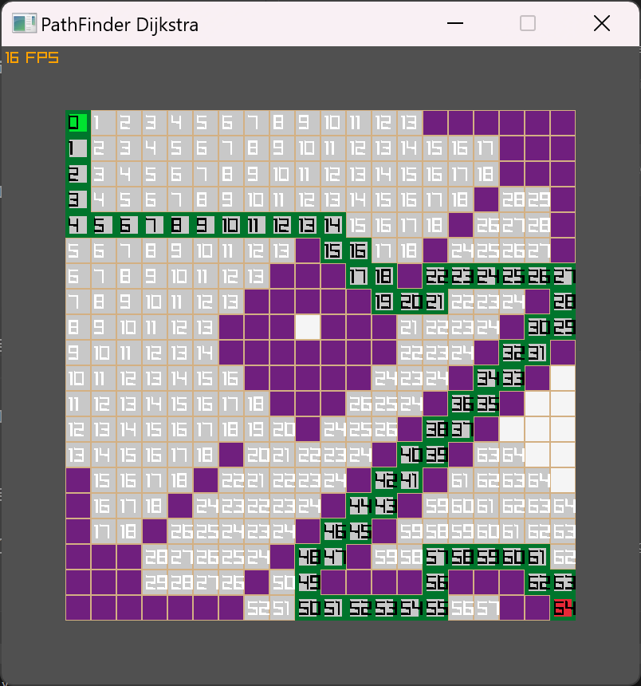

# **Path Finder: the Dijkstra algorithm using GO**

This is based on the Youtube video from CodeScope:

https://www.youtube.com/watch?v=vid9KO6Evro

The original project is in C and uses the Raylib lib.

Adapted/(Translated) to GO using the Raylib-go lib.

This is an adaptation of the "famous" Dijkstra algorithm for shortest path finder.
For this project the "map" is a 2D grid  but the original algorithm can solve oriented/weighted graph.

**Prerequisites:**

To be able to use Raylib on Windows 11, you would need to install a C compiler. 

Recommended C compiler : Mingw-w64 It needs to be in your Windows path.

You then need to get the raylib package.

```linux
go get -v -u github.com/gen2brain/raylib-go/raylib
```

Youtube tutorial to setup Raylib and gcc for Windows:

https://www.youtube.com/watch?v=VT18uh4t_rs

go version go1.21.8 windows/amd64



How to run it
```linux
go run main.go
````

* Key F for fast forward the steps.

* Key S for step (1 step at a time).

* Key P to reveal path (only if the steps have reach the destination).

* Key 1 to change the start position on the grid.
* Key 2 to change the destination position on the grid.